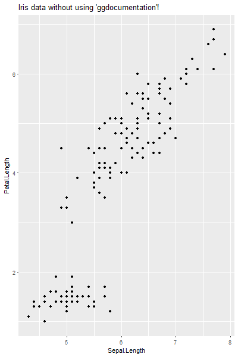
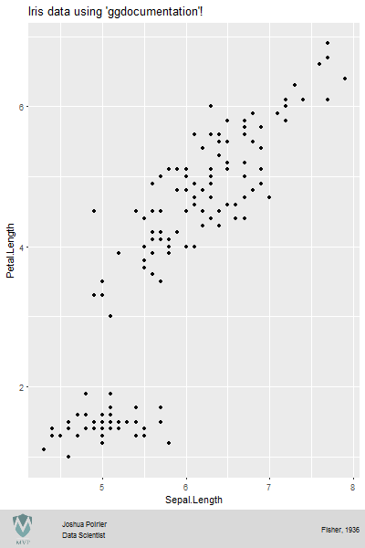
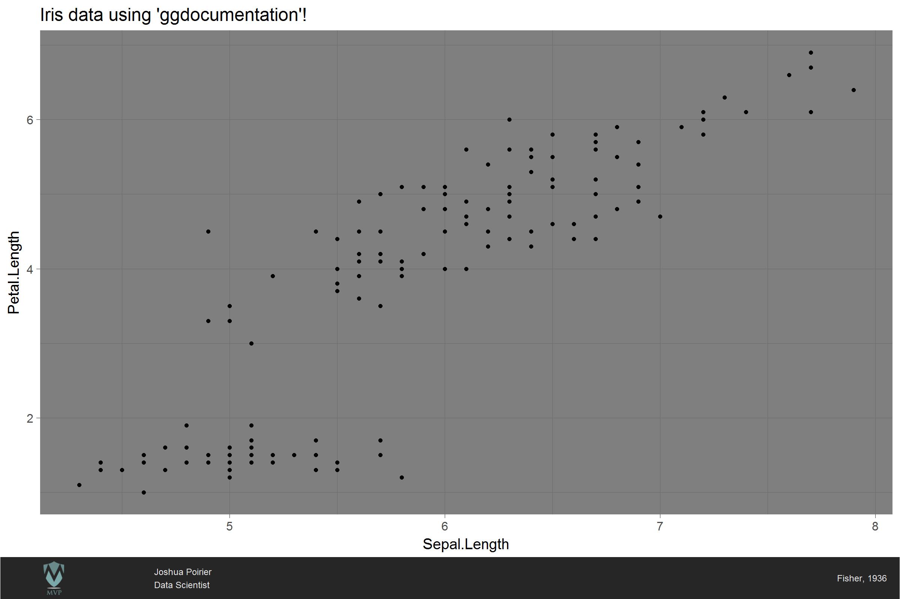
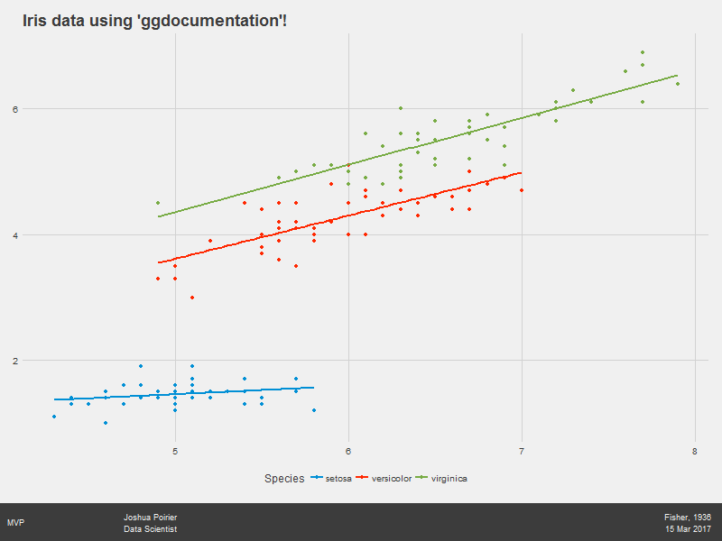
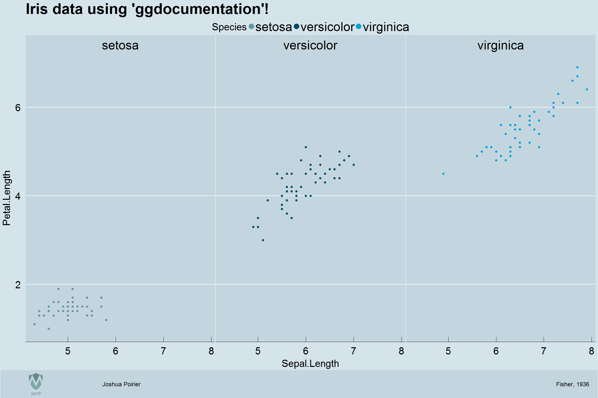

# ggdocumentation

## Overview
An R package allowing users to add documentation (sponsor logo, author name,
  date, data source) to 'ggplot2' plots. It implements Edward Tufte's Principles
   of Analytical Design principle #5: Documentation (from Tufte's book
   "Beautiful Evidence"). It also supports integrating the 'ggthemes' package.  

## Install
This package is not currently available from CRAN (I hope to get there!). To
install it you must install the development version from github, using the
**devtools** package.

```R
library("devtools")
install_github("joshuaadampoirier/ggdocumentation")
```

## Contribute
Contributions are welcome! Also, please let me know of any bugs/errors you find!

## Examples

*ggdocumentation* adds documentation to your *ggplot2* plots! Below shows what
this package can do!

Without ggdocumentation            |  With ggdocumentation
:---------------------------------:|:---------------------------------:
  |  

The plot above right was created using the following code.

```R
library("ggdocumentation")

# build a ggplot2 plot
g <- ggplot(iris, aes(Sepal.Length, Petal.Length)) +
     labs(title="Iris data using 'ggdocumentation'!") +
     geom_point()

# add the documentation!
doc_plot(g, author="Joshua Poirier", data_source="Fisher, 1936", sponsor="MVP")
```

Instead of the name of the sponsor you can place their logo as a **PNG** image.
Think how happy your company will be!  In my experience with working with logos,
this means we have to bump up the image resolution. I accomplish that here by
saving the plot to a PNG file and setting it's size (I also have to bump up the
base text size, and geom_point size to keep everything looking normal at this
scale).

```R
library("ggdocumentation")

g <- ggplot(iris, aes(Sepal.Length, Petal.Length)) +
     labs(title="Iris data using 'ggdocumentation'!") +
     theme_dark(base_size=40) +
     geom_point(size=5)

png("figures/iris_dark.png", width=2400, height=1600, units="px", bg="white")
doc_plot(g,
         author="Joshua Poirier",
         author_title="Data Scientist",
         data_source="Fisher, 1936",
         img_sponsor="figures/mvp-logo.png",
         theme="dark",
         base_size=32)
dev.off()
```



The package also supports themes from the **ggthemes** package. This is
optional, so you need to reference it yourself!

```R
library("ggdocumentation")
library("ggthemes")

g <- ggplot(iris, aes(Sepal.Length, Petal.Length, col=Species)) +
     labs(title="Iris data using 'ggdocumentation'!") +
     scale_color_fivethirtyeight() +
     theme_fivethirtyeight(base_size=40) +
     geom_point(size=5) +
     geom_smooth(method="lm", se=FALSE)

doc_plot(g,
         author="Joshua Poirier",
         author_title="Data Scientist",
         data_source="Fisher, 1936",
         date=TRUE,
         img_sponsor="figures/mvp-logo.png",
         theme="dark",
         base_size=32)
```



Economist theme with a faceted plots

```R
library("ggdocumentation")
library("ggthemes")

# build a ggplot2 plot
g <- ggplot(iris, aes(Sepal.Length, Petal.Length, col=Species)) +
     labs(title="Iris data using 'ggdocumentation'!") +
     facet_grid(. ~ Species) +
     scale_color_economist(guide=guide_legend(override.aes=list(size=10))) +
     theme_economist(dkpanel=TRUE, base_size=40) +
     geom_point(size=4)

# open a graphics device (save to png file)
png("figures/iris_economist-facet.png",
    width=2400, height=1600, units="px", bg="white")

# add ggdocumentation
doc_plot(g,
         author="Joshua Poirier",
         data_source="Source: Fisher, 1936",
         img_sponsor="figures/mvp-logo.png",
         theme="economist",
         dkpanel=TRUE,
         base_size=32)

# turn off graphics device
dev.off()
```


